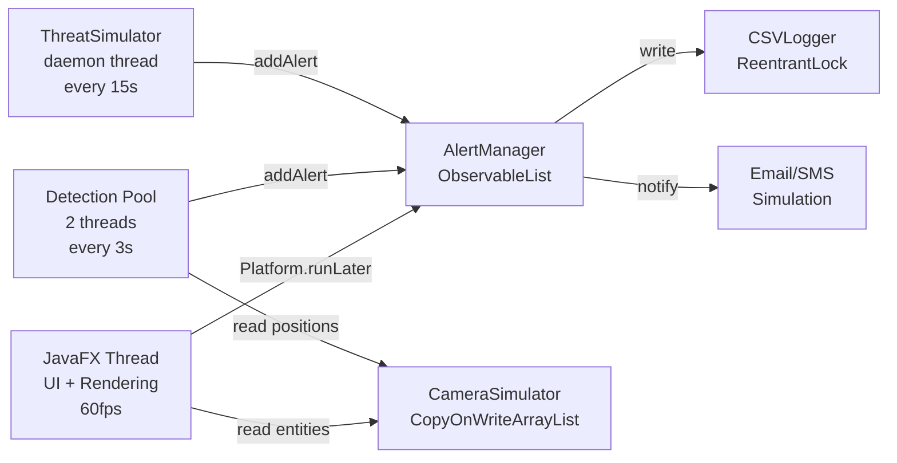

<p align="center">
  
  
  
  
  
</p>

<h1 align="center">🛡️ SENTINEL</h1>
<h3 align="center">Real-Time Intelligent Surveillance & Threat Detection System</h3>

<p align="center">
  <i>A defense-grade, multi-camera surveillance monitoring platform with AI-simulated threat detection,<br/>
  real-time alerting, PDF reporting, and tactical map visualization.</i>
</p>

---

## 🎯 Project Overview

**SENTINEL** is a comprehensive real-time surveillance system that simulates an enterprise-grade security command center. Built entirely in **Java 17+** with **JavaFX 21**, it demonstrates advanced concepts in concurrent programming, event-driven architecture, and real-time data visualization.

The system monitors multiple camera feeds simultaneously, runs 4 independent detection engines in parallel, and provides instant threat classification with automated alerting — all rendered through a premium dark-themed military-style dashboard.

### 🏆 Key Highlights
- **2,500+ lines** of production-quality Java code across **18 source files**
- **Multi-threaded architecture** with 3 concurrent thread groups
- **4 AI detection modules** running simultaneously
- **Real-time 60fps** Canvas-based video feed rendering
- **Thread-safe alert pipeline** with `ConcurrentLinkedQueue` + `Platform.runLater()`
- **Zero external native dependencies** — fully self-contained demo

---

## ✨ Features

### 🎥 Live Surveillance Feed
- 60fps Canvas-rendered video with animated entities (people + vehicles)
- 3 virtual cameras with independent scenes and entity physics
- Real-time tracking boxes, scan-line effects, and HUD overlays
- Grid-based tactical rendering with timestamp watermarks

### 🔍 Multi-Modal Detection Engine

| Module | Algorithm | Detects | Alert Level |
|--------|-----------|---------|------------|
| **Motion Detection** | Frame differencing + ray-casting polygon intersection | Movement in restricted zones | LOW → HIGH |
| **Face Recognition** | Watchlist matching with confidence scoring (75% threshold) | 5 known suspects with aliases | MEDIUM → CRITICAL |
| **Object Detection** | Simulated YOLO v8 with grid-based tracking | Weapons, drones, abandoned objects | MEDIUM → CRITICAL |
| **Behavior Analysis** | Temporal position tracking with clustering | Loitering, running, crowd formation | MEDIUM |

### 🔐 Restricted Zone System
- **User-drawn polygon zones** directly on the video feed
- Click-to-place vertex points → automatic polygon closure
- **Ray-casting algorithm** for real-time point-in-polygon intrusion detection
- Per-camera zone management with visual overlay

### ⚠️ Intelligent Alert System
- **4-tier threat classification**: LOW → MEDIUM → HIGH → CRITICAL
- Color-coded alert cards with confidence percentage and source metadata
- Automatic **threat escalation** (3+ HIGH alerts → system goes CRITICAL)
- Simulated **email + SMS notifications** for HIGH/CRITICAL events
- Thread-safe `ObservableList` binding for instant UI updates

### 🗺️ Tactical Map Visualization
- Bird's-eye facility layout with building footprints
- Camera positions with online/offline status indicators
- Threat markers sized and colored by severity
- Compass rose and scale reference

### 📊 Reporting & Logging
- **PDF reports** (OpenPDF) with executive summary, timeline table, camera breakdown
- **CSV logging** (`alerts_log.csv`) with thread-safe `ReentrantLock` writes
- Auto-generated report IDs and classification markings

### 🎤 Command Terminal
- Text-based command interface (simulating voice control)
- 9 commands: `help`, `show last alert`, `show critical alerts`, `generate report`, `system status`, camera switching, etc.
- Keyboard shortcuts: `Ctrl+L`, `Ctrl+R`, `Ctrl+A`

### 🔒 Role-Based Access Control
- **SHA-256 password hashing** with hardcoded user database
- **ADMIN** role: Full access (reports, configuration, all panels)
- **OPERATOR** role: View-only (alerts and camera feeds)
- Animated login screen with particle background

---

## 🏗️ Architecture

```
┌─────────────────────────────────────────────────────────────┐
│                    PRESENTATION LAYER                        │
│  LoginController → MainController → AlertController          │
│  (JavaFX Application Thread - 60fps AnimationTimer)          │
├─────────────────────────────────────────────────────────────┤
│                    DETECTION LAYER                            │
│  MotionDetector │ FaceRecognizer │ ObjectDetector │ BehaviorAnalyzer │
│  (ScheduledExecutorService - 2 threads, 3s interval)         │
├─────────────────────────────────────────────────────────────┤
│                    SIMULATION LAYER                           │
│  CameraSimulator (CopyOnWriteArrayList entities)             │
│  ThreatSimulator (daemon thread, 15s interval)               │
├─────────────────────────────────────────────────────────────┤
│                    DATA LAYER                                 │
│  AlertManager (ConcurrentLinkedQueue → ObservableList)        │
│  CSVLogger (ReentrantLock) │ ReportGenerator (OpenPDF)        │
│  UserAuth (SHA-256)                                          │
└─────────────────────────────────────────────────────────────┘
```

### Threading Model



---

## 📁 Project Structure

```
src/main/java/com/sentinel/surveillance/
│
├── MainApp.java                    # Application entry point
│
├── controller/
│   ├── LoginController.java        # Animated login with SHA-256 auth
│   ├── MainController.java         # Dashboard orchestrator (450 lines)
│   └── AlertController.java        # Custom ListView cell renderer
│
├── detection/
│   ├── MotionDetector.java         # Frame differencing + polygon zones
│   ├── FaceRecognizer.java         # Watchlist matching (5 suspects)
│   ├── ObjectDetector.java         # Simulated YOLO detection
│   └── BehaviorAnalyzer.java       # Loitering / running / crowd
│
├── alert/
│   ├── ThreatLevel.java            # Enum: LOW, MEDIUM, HIGH, CRITICAL
│   ├── Alert.java                  # Immutable alert data model
│   └── AlertManager.java           # Thread-safe central event hub
│
├── simulation/
│   ├── CameraSimulator.java        # 3 virtual cameras + entity physics
│   └── ThreatSimulator.java        # Background scenario generator
│
├── database/
│   ├── CSVLogger.java              # Thread-safe CSV persistence
│   └── UserAuth.java               # Authentication + RBAC
│
├── ui/
│   └── MapView.java                # Tactical map Canvas
│
└── utils/
    ├── ReportGenerator.java        # PDF report builder (OpenPDF)
    └── VoiceCommandSimulator.java  # Command terminal processor
```

---

## 🚀 Quick Start

### Prerequisites
- **Java 17+** (JDK, not JRE) — [Download Adoptium](https://adoptium.net/)
- Maven is **auto-downloaded** on first run

### Run

```bash
# Clone the repository
git clone https://github.com/YOUR_USERNAME/sentinel-surveillance-system.git
cd sentinel-surveillance-system

# Option 1: Windows batch script
run.bat

# Option 2: Direct Maven command
.maven\apache-maven-3.9.6\bin\mvn.cmd javafx:run

# Option 3: If Maven is in PATH
mvn javafx:run
```

### Login Credentials

| Username | Password | Role | Access Level |
|----------|----------|------|-------------|
| `admin` | `admin` | ADMIN | Full access — reports, config, all panels |
| `operator` | `operator` | OPERATOR | View-only — alerts and camera feeds |
| `commander` | `sentinel2024` | ADMIN | Full access |

---

## 🎮 Usage Guide

### Dashboard Controls
| Control | Action |
|---------|--------|
| **Camera Dropdown** | Switch between Gate 1, Perimeter East, Watchtower 2 |
| **🔲 Draw Zone** | Enter polygon drawing mode on video feed |
| **Clear Zones** | Remove all restricted zones from current camera |
| **⚡ Simulate Threat** | Trigger dramatic CRITICAL cascading scenario |
| **📄 Report** | Generate PDF incident report (Admin only) |

### Keyboard Shortcuts
| Shortcut | Action |
|----------|--------|
| `Ctrl+L` | Show last alert details |
| `Ctrl+R` | Generate PDF report |
| `Ctrl+A` | List critical alerts |

### Command Terminal
```
> help                    → List all commands
> show last alert         → Display most recent alert
> show critical alerts    → Filter CRITICAL alerts
> generate report         → Create PDF report
> system status           → System health overview
> show camera gate        → Switch to Gate 1
> show camera perimeter   → Switch to Perimeter East
```

---

## 🔧 Technical Deep Dive

### Concurrency & Thread Safety
- **`CopyOnWriteArrayList`** for camera entities — safe concurrent read by FX thread + detection threads
- **`volatile String currentCameraName`** — lock-free synchronization between UI and detection
- **`ConcurrentLinkedQueue`** in AlertManager — non-blocking alert ingestion from multiple threads
- **`ReentrantLock`** in CSVLogger — safe file I/O from any thread
- **`Platform.runLater()`** — marshals all UI updates to JavaFX Application Thread

### Detection Algorithms
- **Motion**: Euclidean distance between consecutive frame positions, configurable threshold
- **Face Recognition**: Probabilistic matching with per-suspect cooldown timer (15s)
- **Object Detection**: Random event generation with grid-based temporal tracking for abandoned objects
- **Behavior**: Position history tracking with radius-based loitering (50px/10s) and velocity-based running (>15px/frame)

### Threat Escalation Logic
```
if (recentCriticalCount > 0) → CRITICAL
else if (recentHighCount >= 3) → CRITICAL (auto-escalation)
else if (recentHighCount > 0) → HIGH
else if (recentMediumCount > 0) → MEDIUM
else → LOW
```

---

## 📋 Output Files

| File | Location | Description |
|------|----------|-------------|
| Alert CSV | `logs/alerts_log.csv` | All alerts with ID, timestamp, camera, type, level, confidence, coordinates |
| PDF Report | `reports/SENTINEL_Report_*.pdf` | Executive summary, alert timeline, camera breakdown |
| Console | `stdout` | Email/SMS simulation output |

---

## 🛠️ Tech Stack

| Technology | Version | Purpose |
|-----------|---------|---------|
| Java | 17+ | Core language |
| JavaFX | 21 | GUI framework (Canvas, controls, CSS, animations) |
| OpenPDF | 1.3.30 | PDF report generation |
| Maven | 3.9.6 | Build system & dependency management |
| SHA-256 | JDK built-in | Password hashing |

---

## 🗺️ Roadmap

- [ ] Real camera integration via OpenCV `VideoCapture`
- [ ] REST API bridge to Python YOLO inference server
- [ ] Database backend (MySQL/PostgreSQL) for alert persistence
- [ ] WebSocket-based remote monitoring dashboard
- [ ] Multi-floor facility map with zone hierarchy
- [ ] Alert acknowledgment workflow with audit trail

---

## 👤 Author

**Vasu Nandan**

---

## 📄 License

This project is licensed under the MIT License — see the [LICENSE](LICENSE) file for details.

---

<p align="center">
  <b>Built with ☕ Java 17 + JavaFX 21</b><br/>
  <i>Defense-grade surveillance. Real-time intelligence.</i>
</p>
